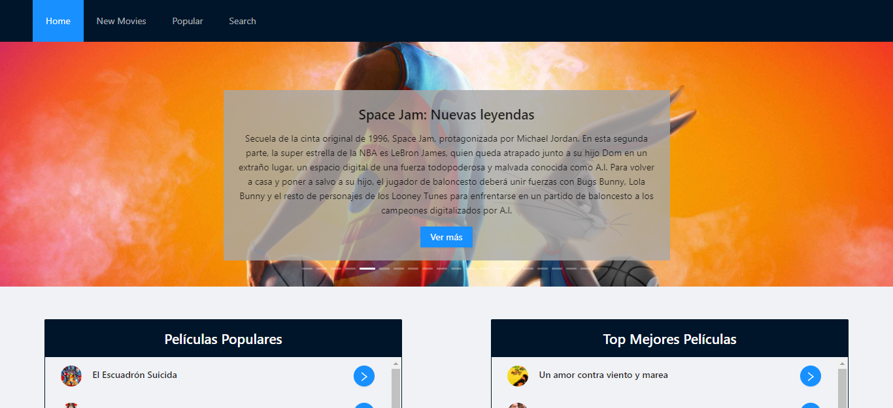

## Movies React de Hannah Carabolante

#### Este proyecto es una aplicación que permite conectarse a una API de películas, los estrenos, populares y mejor puntadas. Fue realizado con el fin de su evaluación a partir de lo aprendido en el octavo y último módulo de la sexta generación de FRONTEND de [ADA](https://adaitw.org/).

<br>


***

### Si quiere echarle un vistazo puede darle click a este [enlace](https://carabolanteh.github.io/movies-react/).

<br>


***

### Si quiere tener el código en su computadora, deberá de seguir estos pasos en su terminal.

- Ir al [repositorio](https://github.com/carabolanteh/movies-react).
- Darle click al botón de forkear.
- Darle click al botón de code color verde.
- Copiar la url.
- Abrir tu terminal y poner el comando de  ```git clone <url>```.
- Entrar a la carpeta del proyecto y abrirlo en tu IDE.

### Este proyecto requiere de la instalación de dependencias. (antd, ant-design/icons, moment)

<br>

***

### A continuación, le dejo una imagen ilustrativa de como debería de verse el portafolio en su navegador.

<br>




<br>

***

<br>

### Este portafolio no sería lo que es sin la ayuda de mi compañera [Gabriela](https://github.com/Mandisa-94), mis profesores [Jonh](https://github.com/Jonhks) y Leydy y las demás compañeras de curso. No me queda más que agradecerles. 🥰

<br>

***

#### De Hannah, con mucho ❤